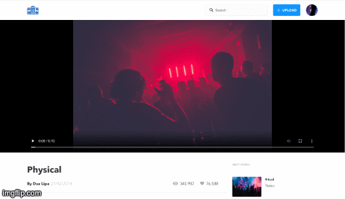

# Video Site
A YouTube inspired Single Page Application built using React.js, Sass, Node.js and Express.js.

# Context
This responsive SPA allows users to view a selection of videos and their associated description and comments. Users can post comments to each individual video, as well as upload their own video to the platform.

# Instructions
While this project is still a work in progress, you can view the app in development mode by:

Running npm start in the client directory, and node server.js in the server directory
### `npm start`
### `node server.js`

You must open [http://localhost:3000](http://localhost:3000) to view it in the browser.

# Next Steps
Next steps for this project are to:
- Add the ability for users to upload a video/image to the platform. Currently the video upload functionality automatically populates the video with a hardcoded placeholder image.
- Add a function to count the number on comments on each video
